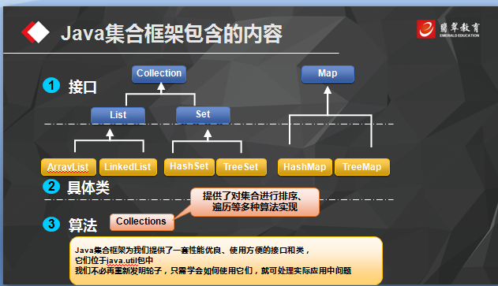
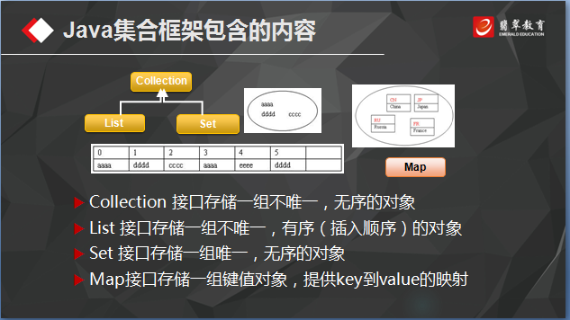

# 2016-9-27工作日志
===================

* 应完成工作
# 正则表达式
   | 规范|描述 |
   | :--------- |:-----------------|
   |\\|表示反斜线（\）字符|
   |\t|表示制表符|
   |\n|表示换行|
   
   | 符号|含义 |示例|解释|匹配输入|
   |:---|:----|:----|:----|:----|
   |[]|可接收的字符列表 |[abcd|a、b、c、d中的任意1个字符|a、b、c、d |
   *套路用法
   
   import java.util.regex.Matcher;
   
   import java.util.regex.Pattern;
   
   public class text3 {
   
    public static void main(String[] args){
    
        //定义一个正则表达字符串
        
        String expression = "(abc)*";
        
        //定义一个需要验证的字符串
        
        String str = "";
        
        //套路用法
        
        Pattern p = Pattern.compile(expression);
        
        Matcher m = p.matcher(str);
        
        //请问str符合expression的规则吗？
        
        boolean bln = m.matches();
        
        //matches()方法返回true的话，那么就表示str负责expression的规则
        
        //反之则不符合
        
        System.out.println(bln);
        
    }
}

*常用正表达式：
  *验证手机号
  *验证身份证号
  *验证银行卡号
  *验证日期格式
  *验证IP地址
  
  *group()方法的使用
  
  public class Group {
  
    public static void main(String[] args){
    
        String expression = "A(B(C))D";
        
        Pattern p = Pattern.compile(expression);
        
        Matcher m = p.matcher("ABCD");
        
        System.out.println("matches:"+m.matches());
        
        System.out.println("groupCount:"+m.groupCount());
        
        System.out.println("group():"+m.group());
        
        System.out.println("group(1):"+m.group(1));
        
        System.out.println("group(2):"+m.group(2));
        
    }
}

* 集合的使用：

* 掌握方法
       1.如何创建 2.如何添加元素 3.如何修改元素 4.如何删除元素 5.如何遍历
       
* list

        *AaaryList  可变数组
        
        import java.uitl.ArrayList;
        improt java.util.Iterator;
        improt java.util.List;
        
        public class ListDemo {
        
    public static void main(String[] args){
    
        //创建
        List<String> list = new ArrayList<String>();
        
        //添加
        list.add("老大");
        
        list.add("老二");
        
        list.add("老三");
        
        list.add("老四");
        
        //修改
        list.add("老五");
        
        //list.add(0，"老五");
        
        //删除
        //list.remove("0");
        
        list.remove("老大");
        
        //查询遍历
        for(int index = 0;index< list.size();index ++) {
        
					String name = list.get(index);
          
					System.out.println(name);
          
				}

				System.out.println("*******************************");
        
				for (String name : list) {
        
					System.out.println(name);
          
				}

				System.out.println("*******************************");
        
				Iterator<String> it = list.iterator();
        
				while(it.hasNext()) {
        
					String name = it.next();
          
					System.out.println(name);
          
				}
			}
		}

* 未完成工作
* 未完成原因
* 工作成功
* 遇到的问题及解决方法
