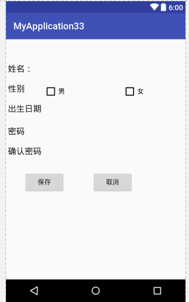

# 2016-10-11工作日志
===================

* 应完成工作
 * 用布局做登录界面
 
  
  
 *  <EditText
 *      android:layout_width="wrap_content"
 *      android:layout_height="wrap_content"
 *      android:text="性别"
 *      android:id="@+id/editText"
 *      android:layout_below="@+id/et_username"
 *      android:layout_alignParentLeft="true"
 *      android:layout_alignParentStart="true" />

 *  <EditText
 *      android:layout_width="wrap_content"
 *      android:layout_height="wrap_content"
 *      android:text="出生日期"

 *      android:layout_below="@+id/editText"
 *      android:layout_alignParentLeft="true"
 *      android:layout_alignParentStart="true"
 *      android:id="@+id/editText3" />

 *  <EditText
 *      android:layout_width="wrap_content"
 *      android:layout_height="wrap_content"
 *      android:text="密码"
 *      android:layout_below="@+id/editText"
 *      android:layout_alignParentLeft="true"
 *      android:layout_alignParentStart="true"
 *      android:layout_marginTop="48dp"
 *      android:id="@+id/editText4" />

 *  <EditText
 *      android:layout_width="wrap_content"
 *      android:layout_height="wrap_content"
 *      android:text="确认密码"

 *      android:layout_below="@+id/editText4"
 *      android:layout_alignParentLeft="true"
 *      android:layout_alignParentStart="true"
 *      android:id="@+id/editText5" />

 *  <CheckBox
 *      android:text="男"
 *      android:layout_width="wrap_content"
 *      android:layout_height="wrap_content"
 *      android:layout_above="@+id/editText3"
 *      android:layout_toRightOf="@+id/editText3"
 *      android:layout_toEndOf="@+id/editText3"
 *      android:id="@+id/checkBox" />

 *  <EditText

 *      android:id="@+id/et_username"
 *      android:layout_width="fill_parent"
 *      android:layout_height="wrap_content"
 *      android:text="姓名："
 *      android:layout_marginTop="42dp"
 *      android:layout_alignParentTop="true"
 *      android:layout_alignParentLeft="true"
 *      android:layout_alignParentStart="true" />

 *  <CheckBox
 *      android:text="女"
 *      android:layout_width="wrap_content"
 *      android:layout_height="wrap_content"
 *      android:id="@+id/checkBox2"
 *      android:layout_above="@+id/editText2"
 *      android:layout_alignRight="@+id/editText2"
 *      android:layout_alignEnd="@+id/editText2" />

 *  <EditText
 *      android:layout_width="wrap_content"
 *      android:layout_height="wrap_content"
 *      android:inputType="date"
 *      android:ems="10"
 *      android:id="@+id/editText2"
 *      android:layout_alignBaseline="@+id/editText3"
 *      android:layout_alignBottom="@+id/editText3"
 *      android:layout_toRightOf="@+id/editText3"
 *      android:layout_toEndOf="@+id/editText3" />

 *  <Button
 *      android:text="保存"
 *      android:layout_width="wrap_content"
 *      android:layout_height="wrap_content"
 *      android:layout_below="@+id/editText5"
 *      android:layout_alignRight="@+id/checkBox"
 *      android:layout_alignEnd="@+id/checkBox"
 *      android:layout_marginTop="20dp"
 *      android:id="@+id/button" />

 *  <Button
 *      android:text="取消"
 *      android:layout_width="wrap_content"
 *      android:layout_height="wrap_content"
 *      android:layout_alignTop="@+id/button"
 *      android:layout_alignRight="@+id/editText2"
 *      android:layout_alignEnd="@+id/editText2"
 *      android:layout_marginRight="23dp"
 *      android:layout_marginEnd="23dp"
 *      android:id="@+id/button2" />

 *  </RelativeLayout>

* 未完成工作
* 未完成原因
* 工作成功
* 遇到的问题及解决方法
