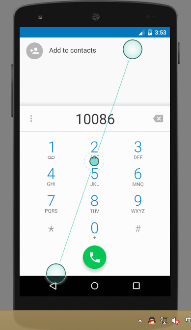
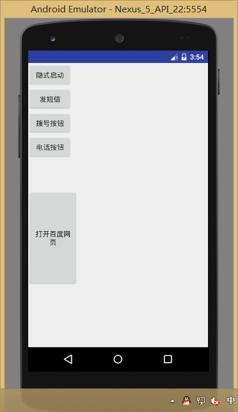

# 2016-10-21工作日志
===================

* 应完成工作
   实现打电话发短信功能
   
   
   
   public class MainActivity extends Activity {

    @Override
    protected void onCreate(Bundle savedInstanceState) {
        super.onCreate(savedInstanceState);
        setContentView(R.layout.activity_main);

        Button button1= (Button) findViewById(R.id.button1);
        button1.setOnClickListener(new View.OnClickListener() {
            @Override
            public void onClick(View v) {
                Intent intent =new Intent("com.example.administrator.chang.ACTION_START");
                startActivity(intent);
            }
        });
        //发短信
        Button  button2= (Button) findViewById(R.id.button2);
        button2.setOnClickListener(new View.OnClickListener() {
            @Override
            public void onClick(View v) {
                Intent intent = new Intent();
                intent.setAction(Intent.ACTION_SENDTO);
                intent.setData(Uri.parse("smsto:10086"));
                intent.putExtra("sms_body","The SMS text");
                startActivity(intent);
            }
        });
        // 拨号
        Button  button3= (Button) findViewById(R.id.button3);
        button3.setOnClickListener(new View.OnClickListener() {
            @Override
            public void onClick(View v) {
                Intent intent =new Intent();
                intent.setAction(Intent.ACTION_DIAL);
                intent.setData(Uri.parse("tel:10086"));
                startActivity(intent);
            }
        });
        //打电话
        Button  button4= (Button) findViewById(R.id.button4);
        button4.setOnClickListener(new View.OnClickListener() {
            @Override
            public void onClick(View v) {
                Intent intent=new Intent();
                intent.setAction(Intent.ACTION_CALL);
                intent.setData(Uri.parse("tel:10086"));
                startActivity(intent);
            }
        });

        Button  button5= (Button) findViewById(R.id.button5);
        button5.setOnClickListener(new View.OnClickListener() {
            @Override
            public void onClick(View v) {
                Intent intent=new Intent();
                intent.setAction(Intent.ACTION_VIEW);
                intent.setData(Uri.parse("http://www.baidu.com"));
                startActivity(intent);
            }
        });

    }

}

public class SecondActivity extends Activity {
    @Override
    protected void onCreate(Bundle savedInstanceState) {
        super.onCreate(savedInstanceState);
        setContentView(R.layout.first_layout);
    }
}

<?xml version="1.0" encoding="utf-8"?>
<LinearLayout xmlns:android="http://schemas.android.com/apk/res/android"
    xmlns:tools="http://schemas.android.com/tools"
    android:orientation="vertical"
    android:layout_width="match_parent"
    android:layout_height="match_parent"

    tools:context=".MainActivity">

    <LinearLayout
        android:layout_width="100dp"
        android:layout_height="wrap_content"
        android:layout_weight="1"
        android:orientation="vertical">

        <Button
            android:id="@+id/button1"
            android:layout_width="wrap_content"
            android:layout_height="wrap_content"
            android:text="隐式启动" />

        <Button
            android:id="@+id/button2"
            android:layout_width="wrap_content"
            android:layout_height="wrap_content"
            android:text="发短信" />

        <Button
            android:id="@+id/button3"
            android:layout_width="wrap_content"
            android:layout_height="wrap_content"
            android:text="拨号按钮" />

        <Button
            android:id="@+id/button4"
            android:layout_width="wrap_content"
            android:layout_height="wrap_content"
            android:text="电话按钮" />
    </LinearLayout>

    <LinearLayout
        android:layout_width="100dp"
        android:layout_height="wrap_content"
        android:layout_weight="2">

        <Button
            android:id="@+id/button5"
            android:layout_width="match_parent"
            android:layout_height="192dp"
            android:text="打开百度网页"
            />

    </LinearLayout>

</LinearLayout>

<?xml version="1.0" encoding="utf-8"?>
<LinearLayout xmlns:android="http://schemas.android.com/apk/res/android"
    android:orientation="vertical" android:layout_width="match_parent"
    android:layout_height="match_parent">

    <EditText
        android:id="@+id/editText1"
        android:layout_width="match_parent"
        android:layout_height="match_parent"
        android:text="这是第二个界面"/>

</LinearLayout>
* 未完成工作
* 未完成原因
* 工作成功
* 遇到的问题及解决方法
