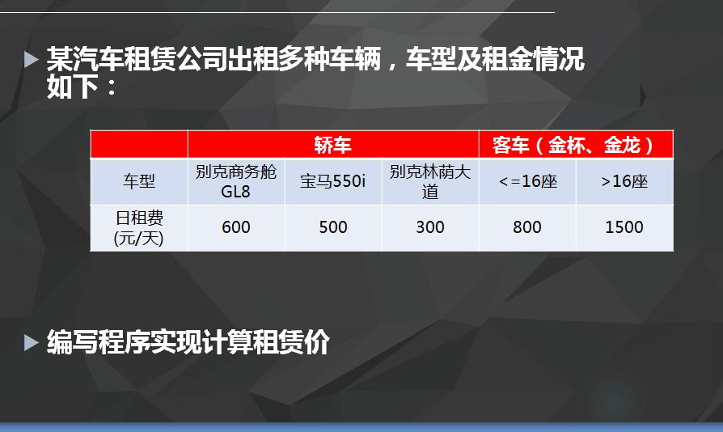

# 2016-9-21工作日志
===================

* 应完成工作
sdshdkjahdsdhadshkjdhadaskjdhkjsdhkcbiadbiabfakbckjasbakbdakbd

* 已完成工作
* public class Person {
   int age;
   static int power = 100;
   public static void main(String[] args){
	   Person hujintao = new Person();
	  
	   hujintao.age = 73;
	   hujintao.power = 70;
	   Person xijinping = new Person();
	   xijinping.age = 74;
	   xijinping.power = 100;
	   
	   System.out.println("hujintao.age="+hujintao.age);
	   System.out.println("hujintao.power="+hujintao.power);
	   
	   System.out.println("xijinping.age="+xijinping.age);
	   System.out.println("xijinping.power="+xijinping.power);
   }
}
* 未完成工作
* 未完成原因
* 工作成功
* 
* public class Animal {
   public void move(){
	   System.out.println("动物可以移动");
	   
   }

public void bark() {
	// TODO Auto-generated method stub
	
}
}

public class Dog extends Animal{
   public void move(){
	   super.move();
	   System.out.println("狗可以跑和走");
   }
  
}

public class Test {
   public static void main(String[] args){
	   
	   Animal b = new Dog();
	   
	   b.move();
	   b.move();
   }
}

public class  Bus extends MotoVehic{
    public int siteNum;
    public int site16 = 800;
    public int siteOther = 1000;
    private int days;
    
    public Bus(String name,int siteNum,int days){
    	super();
    	
		this.siteNum = siteNum;
    	vehicName = name;
    	
    	this.days = days;
    }
    public long CaluMoney(){
    	if(siteNum<=16){
    		return site16*days;
    		
    	}
    	else{
			return siteOther*days;
		}
    }
	@Override
	public long CalcuMoney() {
		return 0;
	}
}

public class Car extends MotoVehic {
    public String type;
    public int days;
    public int money;
    public Car(String type,int days){
    	super();
    	this.type = type;
    	this.days = days;
    }
    public long CalcuMoney(){
    	if("别克商务舱".equals(type)){
    		money = 600;
    	}
    	else if("宝马".equals(type)){
    		money = 500;
    	}
    	else if("别克林荫大道".equals(type)){
    		money = 300;
    	}
		return days*money;
    	
    }
}

public abstract class MotoVehic {
   public String vehicName;
   public String vehicNo;
   public String color;
   public long mileage;
   public String num;
   public abstract long CalcuMoney();
   public void print(){
	   long money = CalcuMoney();
	   System.out.println("别克商务"+vehicName+"宝马："+money);
   }
}

* 遇到的问题及解决方法
