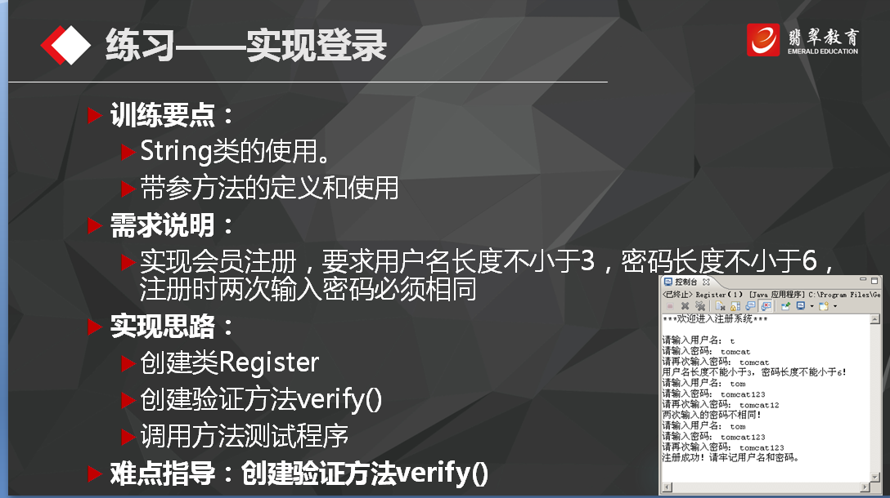
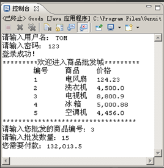

# 2016-9-26工作日志
===================

* 应完成工作

  public class Register {

           public static void main(String[] args) {
                     register();

                 }
             public static void register(){
                    Scanner sc = new Scanner(System.in);
                    System.out.println("请输入用户名和密码以及重复密码");
                    System.out.println("您的用户名是：");
                    String name = sc.next();
                    System.out.println("您的密码是：");
                    String password = sc.next();
                    System.out.println("请您再次输入您的密码是：");
                    String rePassword = sc.next();
                    System.out.println("请输入您的年龄");
                    int age = sc.nextInt();
                    Person per = new Person( name,age,password,rePassword);
                    if(per.isOk()){
                            System.out.println("您输入的信息符合要求，注册成功");
                       }else{
                            System.out.println("您输入的信息不对，注册失败");
                           //register();
                         }
                }
}
    class Person{
            private String name;
            private int age;
        private String password;
             private String rePassword;

                    public Person(String name,int age,String password,String rePassword){
                     this.name = name;
                   this.age = age;
                     this.password = password;
                    this.rePassword = rePassword;
                    }

                    public String getName() {
                     return name;
                }
            public void setName(String name) {
                    this.name = name;
                }
             public int getAge() {
                    return age;
                 }
             public void setAge(int age) {
                     this.age = age;
                 }
             public String getPassword() {
                    return password;
                 }
             public void setPassword(String password) {
                    this.password = password;
                 }
             public void setrePassword(String rePassword) {
                     this.rePassword = rePassword;
                 }

                     public boolean isOk(){
                    String reg1 = "[a-z]\\w*";
                    //String reg2 = "\\d{2}";
                    //String reg3 = "/^[0-9A-Za-z]{6,}$/";
                    String reg3 = "\\d{6}";
                    if(name.matches(reg1)&&password.matches(reg3)&&rePassword.matches(reg3)){
                            return true;
                    }
                         return false;
                 }
         }
         
         静态转换方法:
  public static int parseInt(String s)
	  把字符串转换成int类型的值

  public static Integer valueOf(String s)
	  把字符串转换成Integer对象
  Integer i = Integer.valueOf(“2007”);
  Int value = i.intvalue();

  public class Zifuchuan {
  
      public void show() {
      
        StringBuffer sb = new StringBuffer();
        
        sb.append("*********************").append("欢迎进入商店").append("******************\n");
        
        sb.append("             编号").append("              商品").append("                   价格");
        
        System.out.println(sb);
        
    }
}

  日期计算：
  
  public class For {
  
    public static void main(String[] args) {
    
        Calendar ca = Calendar.getInstance();
        
        ca.set(1927,7,2);
        
        Calendar currentCa=Calendar.getInstance();
        
        long time1 = ca.getTimeInMillis();
        
        long time2 = currentCa.getTimeInMillis();
        
        double dayOfTime = 24*60*60*10000;
        
        double days = (time2 - time1) / dayOfTime;
        
    }
    
}

  Comparable接口：
   public interface Comparable<T>{
   
 public int compareTo(T o) ;
 
 }
  
  System类：
    int   [] array1={3,1,3,6};
    
  int [] array2=new int[7];
  
  System.arraycopy(array1,2,array2,2,1);
  
   Calendar类：
   Date类：
   SimpleDateFormat类：
* 未完成工作
* 未完成原因
* 工作成功
* 遇到的问题及解决方法
